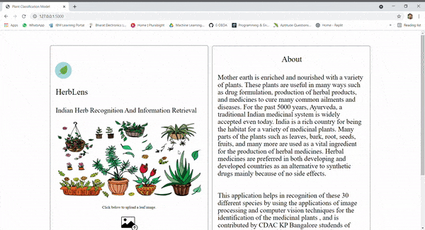

# Herb-Lens

* Mother earth is enriched and nourished with a variety of plants. These plants are useful in many ways such as drug formulation, production of herbal products, and medicines to cure many common ailments and diseases. For the past 5000 years, Ayurveda, a traditional Indian medicinal system is widely accepted even today. 
* India is a rich country for being the habitat for a variety of medicinal plants. Many parts of the plants such as leaves, bark, root, seeds, fruits, and many more are used as a vital ingredient for the production of herbal medicines.
* Herbal medicines are preferred in both developing and developed countries as an alternative to synthetic drugs mainly because of no side effects.
* This application helps in recognition of these 30 different species by using Transfer Leraning techniques for the identification of the medicinal plants
        
#  Overview
* 1835 segmented images with 30 classes 
* Model is trained using mobileNet 
* The Model only classify the plant if only single leaf is given with appropriate background.
* Dataset Link: https://data.mendeley.com/datasets/nnytj2v3n5/1

# prerequisite
Please follow the steps given in How to Run txt file and you will be able to get started with your own model 

# Demo
* Click on camera icon to upload the image from the desired location 
* Now click on detect leaf button the information will be displayed on right side on screen  
* 
